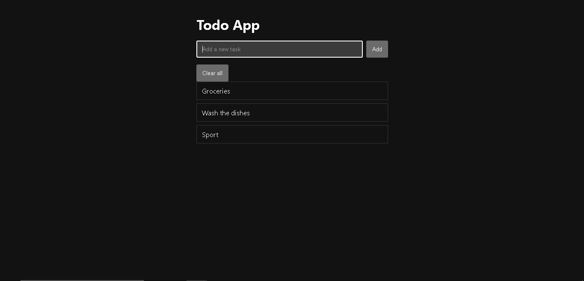
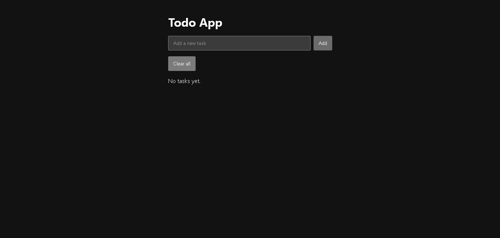

# Zonnu Todo App

Simple Todo application built with vanilla HTML, CSS and JavaScript.
Tasks are saved locally using `localStorage`.

## Live Demo
- GitHub Pages: https://zonnu.github.io/zonnu-todo-app/

## Features
- Add tasks
- Delete tasks by clicking on them
- Clear all tasks
- Persistent storage with `localStorage`
- Empty state message when no tasks exist

## Usage
- Type a task in the input field
- Click "Add" to create a task
- Click a task to delete it
- Use "Clear all" to remove all tasks

## Tech
- HTML / CSS / JavaScript (vanilla)
- No frameworks, no dependencies

## Run locally
1. Clone the repository
2. Open `index.html` in your browser

## Roadmap
- Prevent duplicate tasks
- Mark tasks as completed
- Edit existing tasks

## Screenshots

---
Note: GitHub Pages setup and screenshots were added together during initial documentation.
